# 第1章-面试的流程

## 面试套路

* 简历扫选只是第一步，之后还有电话面试、共享桌面远程面试、现场面试
* 初级程序员看算法和数据结构，高级程序员看项目经验
* **不要不懂装懂，答非所问 - 大忌**，不确定面试官问题一定要问清，直到弄懂面试官的意图再作答。
* 面试官需要写面试报告的哦，所以一般会在一定时间一刻，半小时时间，问你足够多的问题，如果你答的少就问得多，答得多就问的少，这很有可能哦~谁都不想自己被走过场似得问一堆问题然后不了了之，也不跟你说答得对不对，问的问题也没啥思路，这种多半很尴尬，凑时间问完拜拜~

### 面试三种形式

* 各公司都有一套面试流程，**进入面试环节需要先过简历关，所以简历一定要认真写**
* 大部分公司的面试流程是：电话面试->共享桌面远程面试->现场面试
* 当前国内的大厂面试流程是：机考/笔试 + 性格测试(综测) + HR面试 + 技术面试(多轮) + 主管面试 + 谈薪(薪资面)

#### 电话面试

* 投简历过后一两周内注意要**关闭静音或开启来电提醒**，否则会错过面试机试。并且要时刻保证手机能够通话至少一两个小时。
* 电话面试对应聘者清楚表达想法的要求较高，特别是复杂的问题，应尽可能用形象化的语言把细节说清楚。
* 很多外企还会加上英语面试的环节，甚至需要全部用英语交流。
* 如果没有清楚听懂面试官的题目，**不要不懂装懂、答非所问**，要大胆向面试官提问，直到弄清楚面试官的意图为止。

#### 共享桌面远程面试(Phone-Screen Interview)

* 也不是很多公司有这个环节，其实就是要看你代码调试能力，编写代码速度。
* 思考清楚再开始编码。
* 良好的代码命名和缩进对齐习惯。
* 能够进行单元测试。
  * 注意：先写单元测试用例，再写解决问题的函数。**测试在前，开发在后**
* 设置断点、单步跟踪、查看内存、分析调用栈

#### 现场面试(Onsite Interview)

* 规划好路线并估算出行时间。
* 准备好得体的衣服。
* 注意面试邀请函里的面试流程。
* 准备几个问题。

### 面试三个环节

#### 行为面试

* 暖场过程，自我介绍，工作经历，学习经历 30S到1分钟。面试官手头有你的简历，基本废话少说。
* 目的：了解你性格，是否反人类，反社会。心态如何，别吓尿了。
* 行为面试还包括项目，当然，项目就是你过往的行为~，没毛病
* 项目介绍按这个过程来，**大家都很忙，按套路出牌谁也不懵逼**

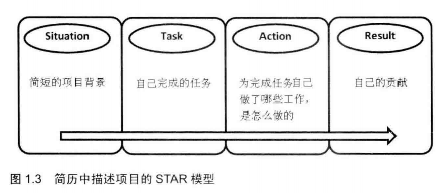
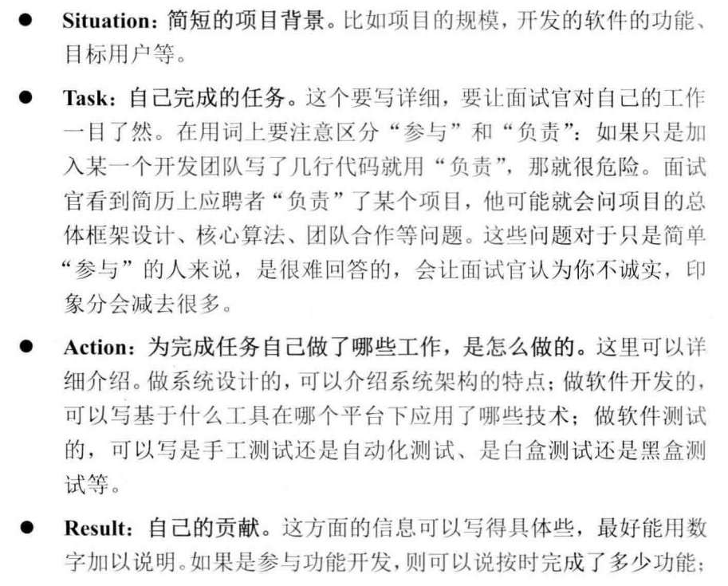
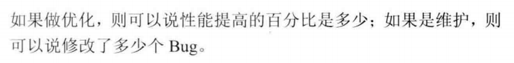

* 项目介绍完，面试官基本会追问如下问题

* 项目介绍突出自己的工作，毕竟是你面试，面试就是把自己端出来求收留~
* 也可能是你自己做的项目但是了解不够透彻，这时候被问懵逼也没什么，老实交代自己没尝试从哪方面去想什么的也可以。
* 态度诚恳，诚实守信，主打社会主义核心价值观。

##### 区分了解+熟悉+精通

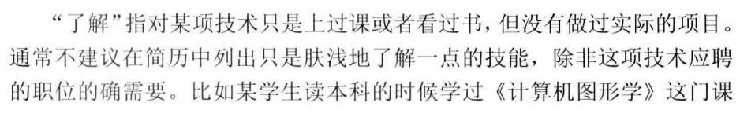

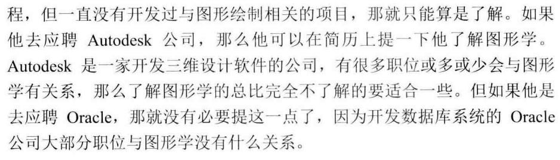

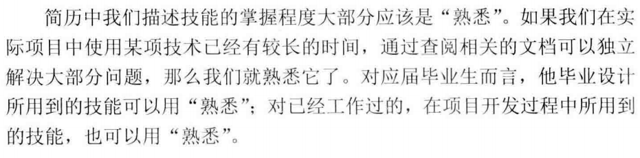

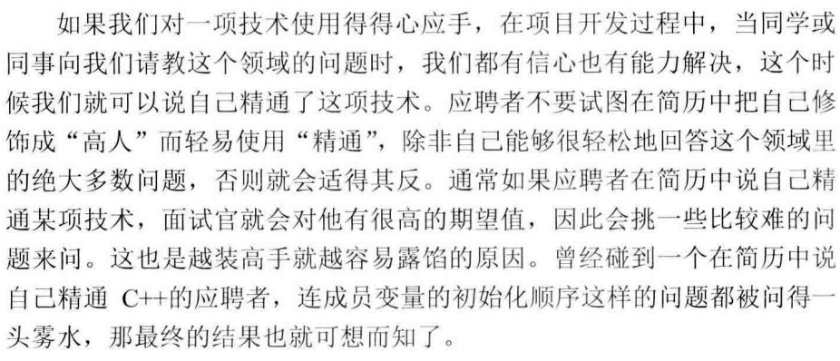

* 量力而行，好自为之~

##### 回答“为什么跳槽”

尽量避免以下原因：

* 老板太苛刻
* 同事太难相处
* 加班太频繁
* 工资太低

#### 技术面试

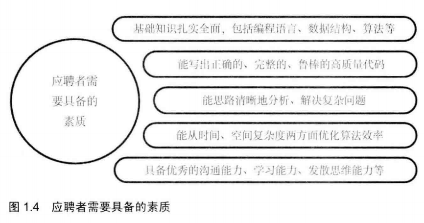

* 技术面试占绝大部分时间，面试官会尽可能虐死你。这是重头戏环节~
* 关注5大素质：
  * 扎实的专业基础
  * 高质量代码编写
  * 分析问题思辨能力
  * 优化时间空间效率
  * 学习沟通能力
* 面试之前要拼命复习or预习，掌握**编程语言、数据结构、算法**等基础知识
* **鲁棒**是Robust的音译，也就是健壮和强壮的意思。它是在异常和危险情况下系统生存的关键。比如说，计算机软件在输入错误、磁盘故障、网络过载或有意攻击情况下，能否不死机、不崩溃，就是该软件的鲁棒性。所谓“鲁棒性”，是指控制系统在一定（结构，大小）的参数摄动下，维持其它某些性能的特性。根据对性能的不同定义，可分为稳定鲁棒性和性能鲁棒性。以闭环系统的鲁棒性作为目标设计得到的固定控制器称为鲁棒控制器。
* 如果问题之间有关联，回答也尽可能关联起来答，举一反三，触类旁通。

##### 扎实的专业基础

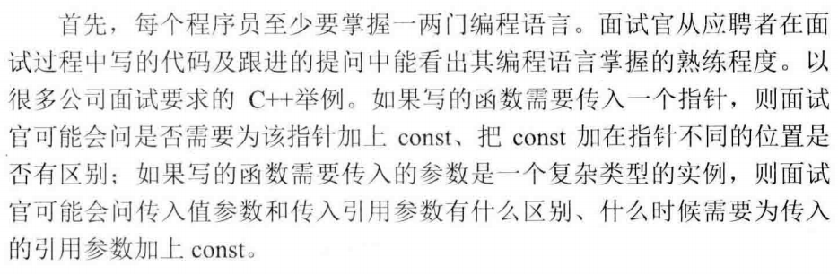

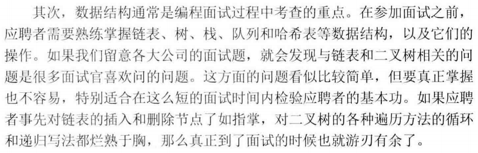

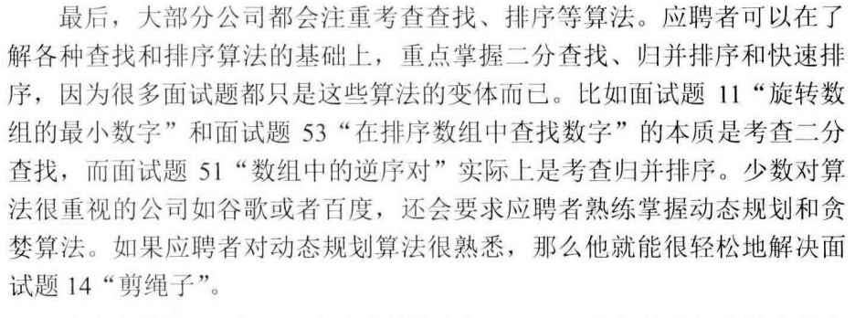

##### 高质量代码

* 如何鉴定代码鲁棒？面试官会用临界条件、特殊输入输出调戏你~其实代码的健壮性就是代码是否考虑到了足够多的问题，很多特殊状态没考虑就容易JJ
* 面试官喜欢用简单问题调戏你哟，你特么的要是一听题目简单就嘚瑟，99.99%就唧唧复唧唧了~

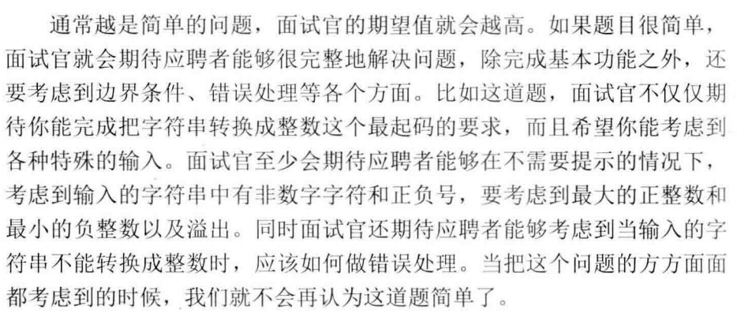

* 面试官不能容忍的就是程序的鲁棒性。智障代码没有考虑周全，不知道判断参数正确性直接执行核心代码妥妥noob(狠狠被拷打的经历ptsd了)~
* C语言里面很神奇的goto语句，慎用。但是不排除面试官菜鸡不会用一看goto让你鸡鸡也不是不可能。毕竟谁也不知道谁水平如何，万一你超神了嘞，虽然这是小概率事件。
* 写完代码之后，不要急于给面试官看，先回顾代码在脑子里跑一遍，理清思路，进行用例测试。检查输入输出，检查边界条件，检查类型安全。
  * **丑数**，首先除2，直到不能整除为止，然后除5到不能整除为止，然后除3直到不能整除为止。最终判断剩余的数字是否为1，如果是1则为丑数，否则不是丑数。
* **软技能**，其实就是团队合作的能力，这年头一个大型软件绝不可能一个人搞定，多是很多大佬协作。
* 面试官可能对你的方向表示怀疑，你对这个行业有多了解基本可以判断。
* 面试官会考察：软技能、学习能力、知识迁移能力、抽象建模能力、发散思维能力

##### 清晰的思路

* 举几个简单的例子让自己理解问题。试着用一两个具体的例子模拟操作的过程。
* 试着用图形表示抽象的数据结构。
* 试着把复杂的问题分解成若干的简单子问题。

##### 优化效率的能力

优秀的程序员对时间和内存的消耗锱铢必较，他们很有激情不断优化自己的代码。当面试官有多种解法的时候，通常期待应聘者给出最优解。

* 当面试官提示还有更好的解法的时候，应聘者不能放弃，应该努力思考时间消耗或者空间消耗上可以优化的地方。

##### 优秀的综合能力

* 学会知识迁移，将已掌握的知识迁移到其他领域，学习新技术和解决新问题就会变得容易。
* 抽象建模能力和发散思考能力。

#### 应聘者提问环节

* 面试官让你提问，要考验你对该公司，该部门是否感兴趣~所
* 去之前了解一下该公司，想想该问啥？至少准备一两个问题
* 不要问薪水
* 不要立即问面试结果，因为问也白问，都是全都面完优胜劣汰
